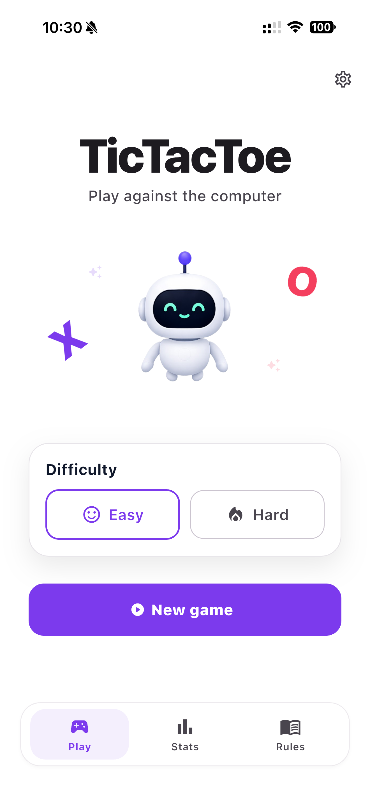
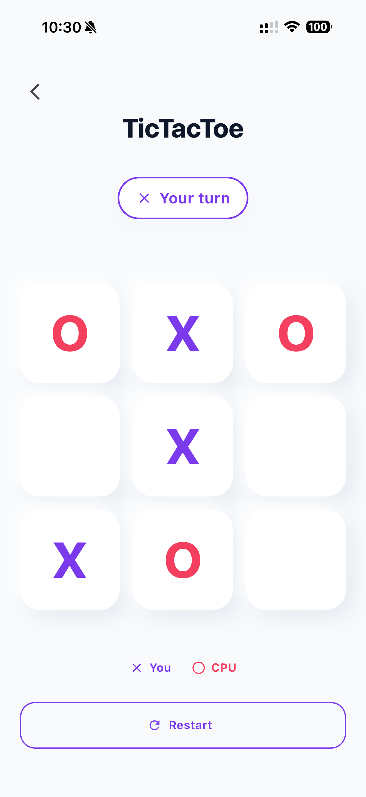
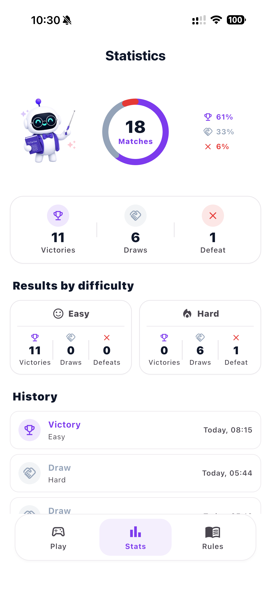

# TicTacToe Flutter Challenge

## Overview

TicTacToe is a Flutter technical challenge where a human player plays locally against a CPU opponent.

The project focuses on Clean Architecture, testability, maintainability, and a production-oriented Flutter structure.

## Highlights

- Human vs CPU Tic-Tac-Toe
- Easy and Hard difficulty levels
- Game statistics with match history
- Home bottom navigation with Play, Stats and Rules tabs
- Clean Architecture
- Riverpod state management
- go_router navigation
- English and French localization
- Light and dark themes
- Responsive UI
- Strong automated test coverage

## Screenshots

<p align="center">
  
  
  
</p>

## Getting started

### Prerequisites

- Flutter SDK compatible with the version defined in `pubspec.yaml`
- Tested with Flutter 3.44.0 / Dart 3.12.0

### Install

```bash
flutter pub get
```

### Run

```bash
flutter run
```

### Test

```bash
flutter test
```

### Quality checks

```bash
flutter analyze
dart format . --set-exit-if-changed
```

## Project structure

```txt
lib/
  app/          App-level configuration, router, theme, DI and integrations
  core/         Shared extensions and reusable helpers
  features/     Feature-first application modules
  l10n/         Localization files and generated delegates

test/           Automated tests mirroring the production structure
assets/         Static images used by the UI
```

## Architecture

This project follows a feature-first Clean Architecture approach.

Each feature separates domain logic, data implementations, presentation widgets/controllers, and dependency wiring.

The domain layer remains pure Dart and does not depend on Flutter, Riverpod, SharedPreferences, or any infrastructure detail.

For a deeper technical overview, see [ARCHITECTURE.md](ARCHITECTURE.md).

## Quality & conventions

- Conventional commits
- Husky and commitlint
- flutter_lints
- Automated tests for domain logic, controllers, repositories, widgets, and navigation flows

### Git hooks

This repository uses Husky hooks to run local quality checks automatically:

- `commit-msg` — validates commit messages against Conventional Commits
- `pre-commit` — runs `dart format . --set-exit-if-changed` and `flutter analyze`
- `pre-push` — runs `flutter test`

Install the Git hooks after cloning (npm is used only for Husky and commitlint, not for app dependencies):

```bash
npm install
```

## V1 status

The current version focuses on the requested local Human vs CPU Tic-Tac-Toe experience.

The app includes gameplay, rules, settings, statistics, match history, localization, theming, local persistence, and automated tests.

Non-essential features such as local multiplayer, custom board sizes, analytics, and crash reporting are intentionally kept out of scope for this challenge.
